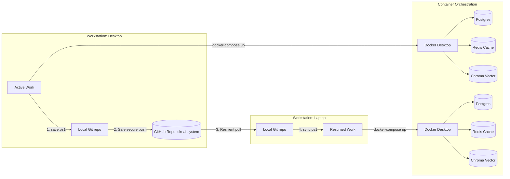

# 💻 SLN AI Creative Operating System — Multi-Device Architecture & Synchronized Workflow

This document details the multi-device development architecture and workflows for developers switching seamlessly between primary workstations (Desktop) and remote stations (Laptop). 

## 🗺️ Multi-Device Architecture Overview



To avoid state drift, DB synchronization loops, and merge conflict storms, SLN AI implements **local database sandboxing via Docker Compose** and **Authoritative remote synchronization via Git rebases**.

---

## 🛠️ Multi-Device Synchronized Workflows

### 💻 Laptop Startup & Dev Loop

When resuming development on your laptop:

1. **Pull and Sync Latest Changes:**
   Open PowerShell in the `sln_ai_system` root and run:
   ```powershell
   .\sync.ps1
   ```
   *This automatically stashes any dirty local changes, pulls the latest changes from the master branch using `rebase` to avoid merge loops, pops your stash, and upgrades python (`requirements.txt`) or node (`package.json`) dependencies if they were modified.*

2. **Boot Infrastructure:**
   Ensure Docker Desktop is running, and spin up the backend dependencies:
   ```powershell
   docker compose up -d
   ```

3. **Run Development Servers:**
   * **Backend:** `.venv\Scripts\python -m uvicorn backend.app:app --reload`
   * **Frontend:** `cd frontend_react; npm run dev`

---

### 🖥️ Desktop Save & Sync Loop

When wrapping up development on your desktop and planning to switch to your laptop:

1. **Auto-Save Work:**
   Save all file changes, open PowerShell in the `sln_ai_system` root and run:
   ```powershell
   .\save.ps1 -Message "Implemented typography guidelines inspector visual features"
   ```
   *This script runs your local pytest suite to ensure no code crashes are committed, checks for security leaks (verifies `.env` is fully ignored in Git), stages all untracked files, commits them, and pushes them securely to GitHub.*

---

## ⚙️ Safe Git Configurations for Developers

To optimize for seamless multi-device switching, run the following commands once on both devices:

### 1. Enable Global Auto-Rebase on Pulls
Prevents messy, redundant "Merge branch 'master' of github.com..." commits that clutter visual history:
```bash
git config --global pull.rebase true
```

### 2. Auto-Stash on Rebase
Ensures Git automatically stashes your local modifications before running a pull/rebase, and pops them afterward, eliminating the need to stash manually:
```bash
git config --global rebase.autoStash true
```

### 3. Git Case Sensitivity (Critical for Windows/Linux Cross-Platform Build Parity)
Enforce absolute casing on file paths so paths like `components/inspector/TypographyInspector.jsx` do not break when compiling on Docker/Linux builds:
```bash
git config --global core.ignorecase false
```

---

## 🐋 Docker Compose Service Mappings

The system utilizes `docker-compose.yml` to orchestrate 5 production services:

| Port | Service Name | Core Purpose | Active Mount Point |
| :--- | :--- | :--- | :--- |
| `5432` | **PostgreSQL** | Primary relational DB storing orders, assets meta, and job queues. | `postgres_data` volume |
| `6379` | **Redis** | Broker queue for LangGraph agent pipelines and layer cache sync. | `redis_data` volume |
| `8000` | **ChromaDB** | Vector DB storing CLIP embeddings for Design Memory RAG. | `chroma_data` volume |
| `8000` | **FastAPI Backend** | Production API serving scene graph compositions, preview JPEG and PDF streams. | `./assets`, `./config`, `./data` |
| `5173` | **Vite SPA** | Multi-stage built React creative studio frontend. | Standard build output |
